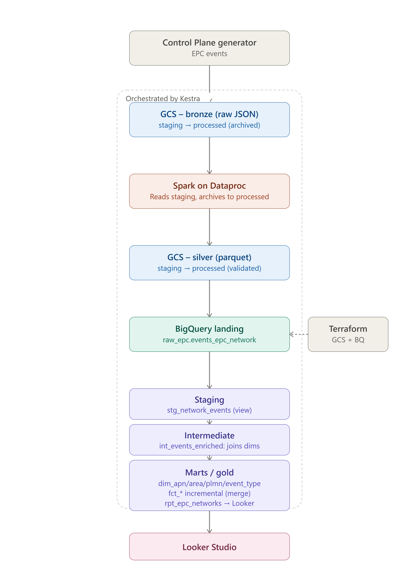
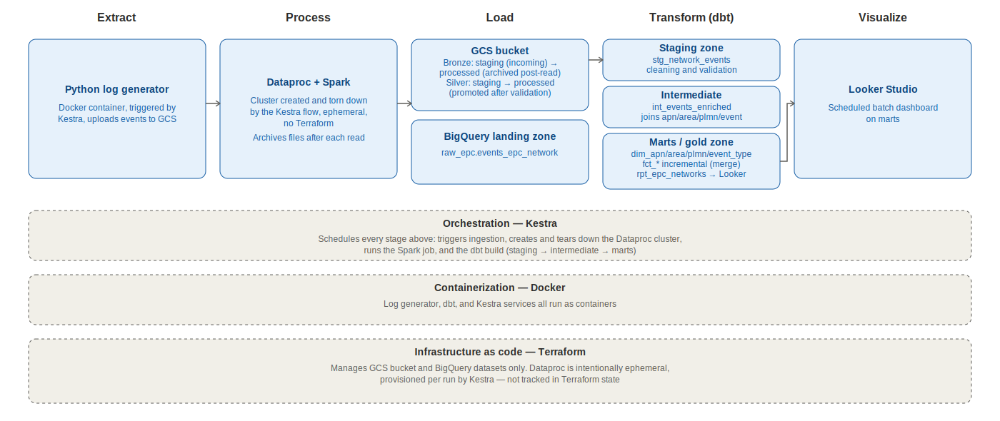
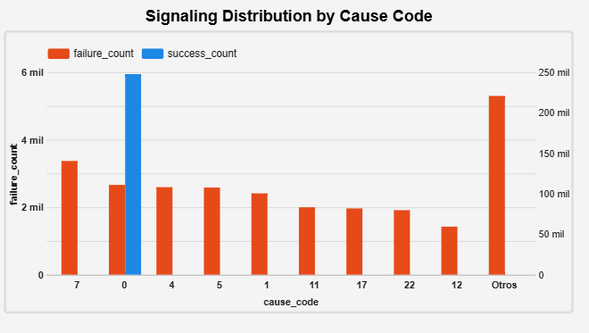
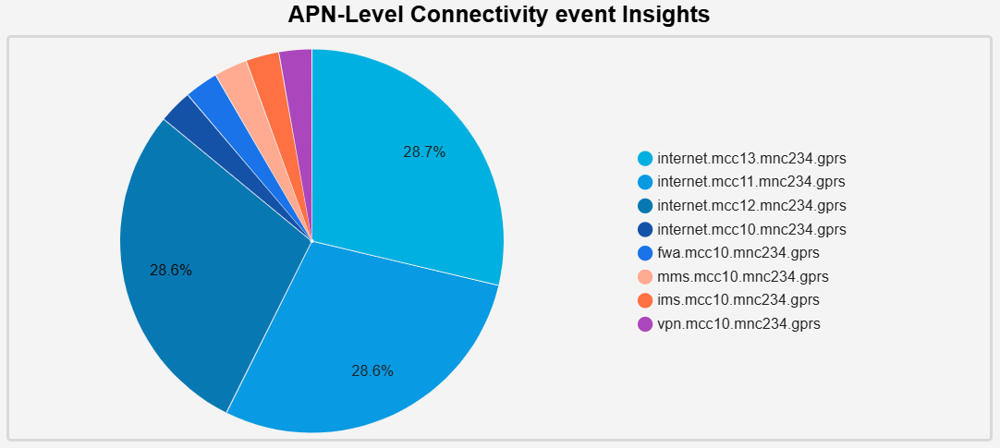
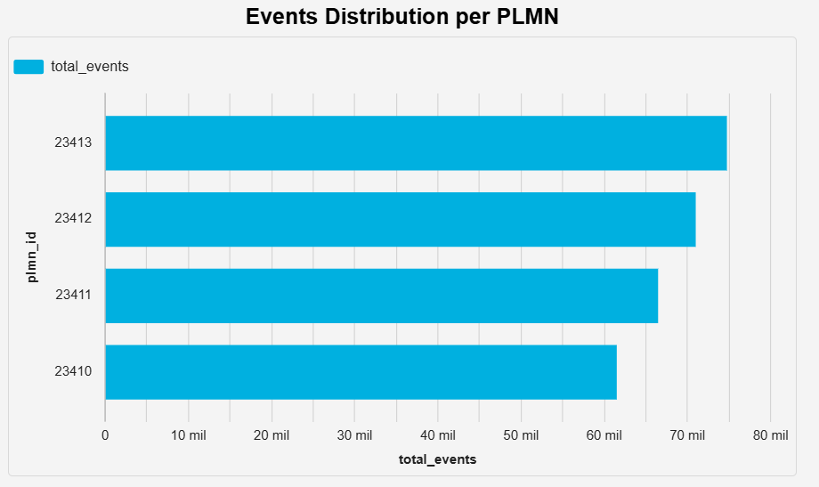
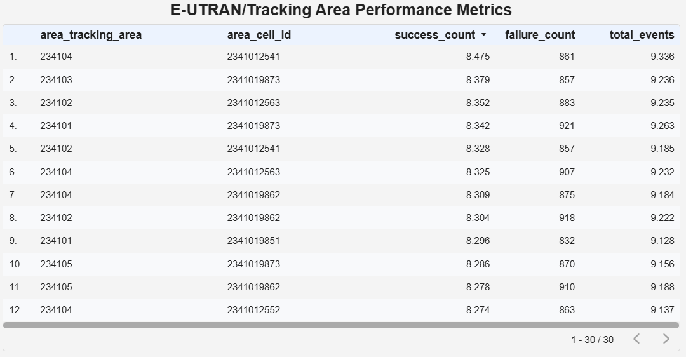
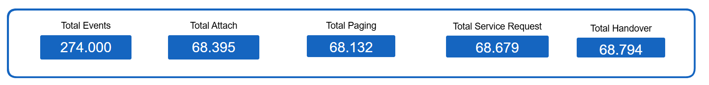
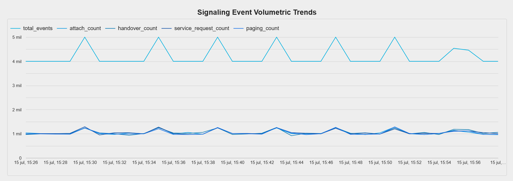
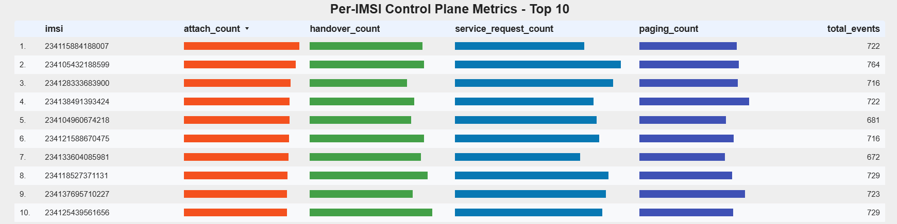

# EPC Network Analytics

> End-to-end batch pipeline for EPC network events.


[](https://www.python.org/downloads/)
[](https://opensource.org/licenses/MIT)
[]()

## Background
  

I've worked with **UMTS/EPC** networks since 2019. One thing I've consistently seen as a problem is the sheer volume of data these networks generate every second, and how little of it gets turned into something usable.

EPC networks generate two broad categories of data: **Control Plane** (CP) and **User Plane** (UP). This project focuses on **CP data**, specifically signaling generated at the *SGSN-MME*, which includes attributes like: 
-   APN.
-   Cell.
-   eNodeB.
-   Tracking Area.
-   Event.
-   IMSI.
-   Cause codes. 

Cause codes and event definitions follow  ***3GPP TS 23.401 (GPRS enhancements for E-UTRAN access)***.

## Problem

Even when this data exists, most operators lack the pipeline to turn it into something queryable in time to act on it, answering questions like:

`which APN had the most failed sessions today?`

Typically requires manual, ad-hoc digging through raw signaling data.

## Objective

An end-to-end batch pipeline that ingests simulated **CP/SGSN-MME** events and turns them into a trusted, documented, query-ready dataset (a **data product**), from raw event generation to a dimensional model in BigQuery to a dashboard, without manual intervention at any step.

## What It Does

The EPC Network Analytics pipeline transforms simulated **Control Plane (CP) network events** into trusted, query-ready KPIs across five layers:

| Layer              | What happens                                                                                                                                                       |
| ------------------ | ------------------------------------------------------------------------------------------------------------------------------------------------------------------ |
| **Ingestion**      | Synthetic **CP/SGSN-MME events** are generated and staged locally, then uploaded to **Google Cloud Storage** as raw JSON (bronze zone), triggered on a schedule by **Kestra**. |
| **Processing**     | A **Spark job**, submitted to a Dataproc cluster, reads bronze events, cleans and transforms them, and writes the result as **Parquet** to a silver zone in GCS.           |
| **Warehousing**    | Silver Parquet files are loaded into **BigQuery** staging tables, partitioned and ready for modeling.                                                                  |
| **Transformation** | dbt Core builds a dimensional model on top of staging: dimensions (APN, PLMN, area, event type), incremental fact tables (sessions, events by APN/area/PLMN) and reports table.   |
| **Serving**        | Looker Studio connects directly to the BigQuery marts for an operational dashboard, event volume, success/failure rate, and distribution by APN/PLMN/area.        |

All five layers are orchestrated by Kestra, which manages the flow from data generation through the final dbt build.

## What this project does NOT cover (yet)

- Real-time/streaming processing of live events.
- Predictive or prescriptive analytics.

---
## Architecture



---

## Tech Stack
| Category                   | Technology                                                      |
| -------------------------- | --------------------------------------------------------------- |
| **Data Generation**        | Python (synthetic CP/EPC event and CDR generator)               |
| **Infrastructure as Code** | Terraform (GCP: GCS bucket + BigQuery datasets)                 |
| **Workflow Orchestration** | Kestra                                                          |
| **Data Lake**              | Google Cloud Storage                                            |
| **Processing**             | Apache Spark on Dataproc (ephemeral cluster, managed by Kestra) |
| **Data Warehouse**         | Google BigQuery                                                 |
| **Transformations**        | dbt Core                                                        |
| **Visualization**          | looker Studio                                                   |
| **Containerization**       | Docker Compose                                                  |


---
## How to Run It

### Prerequisites

- **Docker Desktop** installed and running, or **Docker in WSL**.
- A **GCP Service Account** JSON key saved as `creds/gcp-key.json`
- **Python** 3.10+ 
- **Terraform**

### 1. Start Infrastructure

Boot up Kestra:

```shell
docker-compose up -d
```

### 2. Provision Cloud Resources

```shell
cd terraform-env
terraform init
terraform plan
terraform apply # -auto-approve
cd ..
```

### 3. **`generator`** Container — generates 1K synthetic events in batch mode.

```Shell
cd datasets_generator
docker build -t generate:python .
docker run -it -v raw_data:/app/data/raw --rm generate:python 
```
### 4. Run the Pipeline

Then, open the Kestra UI at [http://localhost:8080](http://localhost:8080/) and execute:

1. **`pipeline_load_to_gcs`** — starts the pipeline, triggerered every 15min, loads the synthetic events from the source data into GCS (Raw - Bronze zone).
2. **`pipeline_spark_dataproc_gcs`** — Starts after `pipeline_load_to_gcs` flow, processes the data from **Bronze zone** to **Silver zone** in **GCS**.
3. **`pipeline_silverzone_to_bq`** — starts after `pipeline_spark_dataproc_gcs` flow, loads the parquet files from the **Silver zone** to tables in **Bigquery**.
4. **`pipeline_run_dbt`** — starts after `pipeline_silverzone_to_bq` flow, models the tables into fact, dimension, and report tables.

### 5. Look at the data in Looker Studio.

Finally, you could connect to a Looker Studio, or any BI dashboard that you prefer. For this project, I built a dashboard, which you can find at the following link:

```
https://datastudio.google.com/reporting/dbedc84e-6f91-4e1a-9ec1-5407360297ff
```

---
## Project Structure


```
epc_network_analytics/
├── dashboard/             # Description about dashboard.
├── datasets_generator/    # Synthetic EPC events network generator and DockerFile.
├── epc_nw/                # dbt Core models (staging + intermediate + marts).
├── spark/                 # Spark batch aggregation.
├── orchestrators/         # Kestra YAML workflow definitions.
│   ├── kestra/            # YAML file of each flow.
├── terraform-env/         # IaC for GCS + BigQuery.
│   ├── keys/              # Credentials to GCP.
```


---
## Dashboard

I used Looker Studio to build a dashboard where I could put together some KPIs and analytics over the events. I think this is a great tool for this,because it has an excellent drill-down feature: it lets you select a value or a piece of information in a chart or table, and then it filters every other element in the dashboard accordingly.

### **EPC Network Analytics Report** 
This dashboard is made up of two pages, where you can see the most important points of this data. 

> Each page in this dashboard has two main filters: Temporal Analysis and Granular timestamp.

#### **EPC Control Plane Performance**

This page is useful for troubleshooting because when there's a failure scenario in the network, the information here helps you narrow down the cause.

##### Success and Failure Rate


Here we can see the success and failure rate. This is very important because it is a basic indicator that gives us aa sense of whether there's a failure event happening at a given moment.

##### Signalling Distribution by Cause Code


This chart shows the distribution of events grouped by cause code. It represents the different cause codes based on the 3GPP standard TS 23.401.

##### APN-Level Connectivity Event Insights



This pie chart is a great visualization, because it shows the percentage of events by APN (Access Point Name). This is a good indicator for Control Plane, because it lets you understand traffic segmentation, type of service, and the proportion of roamers versus local subscribers.

##### Events Distribution Per PLMN



The previous chart gives a rough sense of the roamer-vs-local ratio, but it isn't detailed enough — which is why this chart breaks it down by PLMN."

##### E-UTRAN Tracking Area Performance Metrics



It's often important to break down events by RAN, through tracking area and cell id. This table lets us do that: we can see the performance of each area through its success and failure events, along with the total number of events.


#### **Suscriber Event and Network Analytics Dashboard**

This page is useful for continuous monitoring, since it contains several KPIs that can be broken down by event type.

##### KPI


This section shows every event type present in the event logs, as a rate per event type. It's great for spotting anomalous behavior.

##### Signalling Event Volumetric Trends



The previous section (KPI by event type) is a cumulative KPI. This section shows that same behavior over time.

##### Per-IMSI Control Plane Metrics


This is another way to understand each event type: here I show the top 10 subscribers by event type in a table, which tells you which subscribers are the biggest offenders on the network for each event type.

---

## Contributions

This is a project of personal portfolio. If you have suggestions or find a bug, feel free to:

1. Fork this project.
2. Create a branch with your feature (`git checkout -b feature/AmazingFeature`)
3. Commit your changes (`git commit -m 'Add some AmazingFeature'`)
4. Push (`git push origin feature/AmazingFeature`)
5. Open a Pull Request
---
## License

This project is licensed under the MIT License - see the [LICENSE](LICENSE) file for more details.

---
## Autor

**Raul Santana**
- Packet Core Specialist | EPC network | Data Engineering | Ericsson Stack
- LinkedIn: [ingraulsantana](https://linkedin.com/in/ingraulsantana)
- GitHub: [@rjsantana22](https://github.com/rjsantana22)
- Email: rjsantana95@gmail.com

---
## Acknowledgments

- Synthetic Dataset inspired by in 3GPP TS 23.401 (GPRS enhancements for E-UTRAN access).
---

⚠️ **Note:** This project uses synthetic data. It does not contain real or confidential information from any telecommunications network.