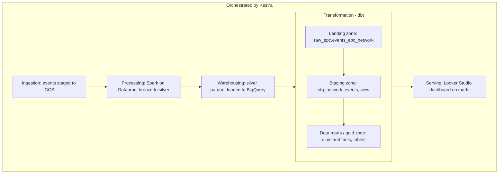

# EPC Network Analytics

## Background
  

I've worked with UMTS/EPC networks since 2019. One thing I've consistently seen as a problem is the sheer volume of data these networks generate every second — and how little of it gets turned into something usable.

EPC networks generate two broad categories of data: Control Plane (CP) and User Plane (UP). This project focuses on CP data, specifically signaling generated at the SGSN-MME, which includes attributes like APN, cell, eNodeB, Tracking Area, Location Area, and event/cause codes. Cause codes and event definitions follow the [3GPP standard](link_to_doc).

## Problem

Even when this data exists, most operators lack the pipeline to turn it into something queryable in time to act on it — answering questions like "which APN had the most failed sessions today?" typically requires manual, ad-hoc digging through raw signaling data.

## What this project does

An end-to-end batch pipeline that ingests simulated CP/SGSN-MME events and turns them into a trusted, documented, query-ready dataset (a **data product**) — from raw event generation to a dimensional model in BigQuery to a dashboard, without manual intervention at any step.
## Objective

Design and deploy a batch pipeline that transforms simulated CP/EPC network events into trusted, queryable KPIs — volume of events, success/failure rate, distribution by APN/PLMN/area — without manual intervention.
## What It Does

The EPC Network Analytics pipeline transforms simulated Control Plane (CP) network events into trusted, query-ready KPIs across five layers:

| Layer              | What happens                                                                                                                                                       |
| ------------------ | ------------------------------------------------------------------------------------------------------------------------------------------------------------------ |
| **Ingestion**      | Synthetic CP/SGSN-MME events are generated and staged locally, then uploaded to Google Cloud Storage as raw JSON (bronze zone), triggered on a schedule by Kestra. |
| **Processing**     | A Spark job, submitted to a Dataproc cluster, reads bronze events, cleans and transforms them, and writes the result as Parquet to a silver zone in GCS.           |
| **Warehousing**    | Silver Parquet files are loaded into BigQuery staging tables, partitioned and ready for modeling.                                                                  |
| **Transformation** | dbt Core builds a dimensional model on top of staging: dimensions (APN, PLMN, area, event type) and incremental fact tables (sessions, events by APN/area/PLMN).   |
| **Serving**        | Looker Studio connects directly to the BigQuery marts for an operational dashboard — event volume, success/failure rate, and distribution by APN/PLMN/area.        |

All five layers are orchestrated by Kestra, which manages the flow from data generation through the final dbt build.

## What this project does NOT cover (yet)

- Real-time/streaming processing of live events.
- Predictive or prescriptive analytics.

See [Roadmap](./ROADMAP.md) for what's planned next.

---
## Architecture

![[architecture.svg]]

---

## Tech Stack
| Category                   | Technology                                                      |
| -------------------------- | --------------------------------------------------------------- |
| **Data Generation**        | Python (synthetic CP/EPC event and CDR generator)               |
| **Infrastructure as Code** | Terraform (GCP: GCS bucket + BigQuery datasets)                 |
| **Workflow Orchestration** | Kestra                                                          |
| **Data Lake**              | Google Cloud Storage                                            |
| **Processing**             | Apache Spark on Dataproc (ephemeral cluster, managed by Kestra) |
| **Data Warehouse**         | Google BigQuery                                                 |
| **Transformations**        | dbt Core                                                        |
| **Visualization**          | Looker Studio                                                   |
| **Containerization**       | Docker Compose                                                  |

