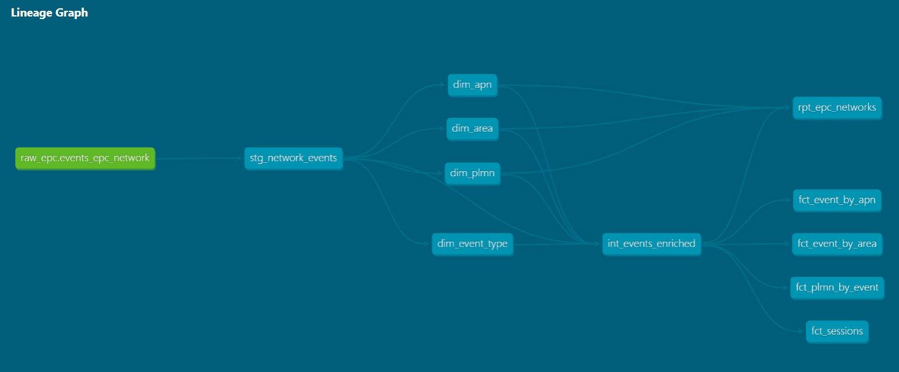

# DBT

dbt(Data Build Tool) is an SQL-based transformation layer that enables modular, testable, and version-controlled data modeling directly within your data warehouse.




## Start the installation
​
```shell
pip install dbt-bigquery
dbt init epc_nw
#You'll be prompted for: path to your GCP credentials, GCP project ID,
#BigQuery dataset name, number of threads (4), job execution timeout
#(set to none), and the region.
dbt debug
```
---

## Configuring the files

### Modify dbt_project.yml

### Create sources.yml

- A **YAML file** inside `models/staging/` that tells dbt where your raw data is
- The **name** of the file is arbitrary — common choices are `sources.yml`, `_sources.yml` (underscore so it sorts to the top), or something named after the origin like `bigquery_sources.yml`
- Then you provide three fields that are **not** arbitrary — they must exactly match your warehouse:
    - **database** — the database name or GCP project
    - **schema** — the schema inside that database or BigQuery dataset
    - **tables** — the individual tables you want to reference

```Yaml
version: 2

sources:
  - name: raw_epc
    database: careful-airfoil-367403 # Or name of your GCP project
    schema: demo_dataset # Or name of your BigQuery dataset
    description: "Datos raw de eventos de red EPC"
    tables:
      - name: events_epc_network
        description: "Eventos raw generados por el generador EPC Docker"
```
---

## Run and validate
```shell
dbt deps
dbt run # or with parameter select : dbt run --select dim_apn
dbt test # or with parameter select : dbt run --select dim_apn
dbt build
dbt docs generate
dbt docs serve

dbt clean

```