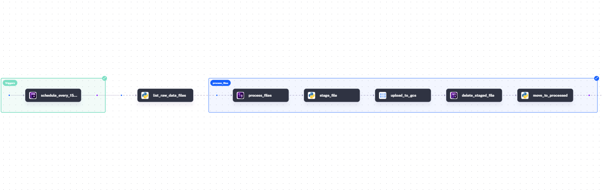
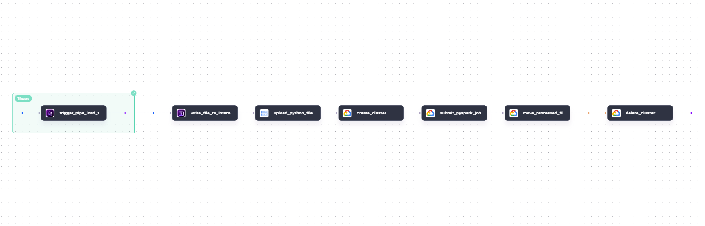
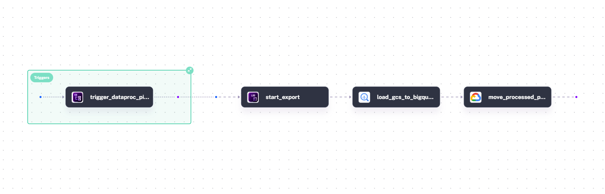
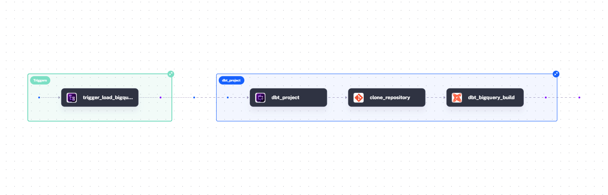

# Orchestrators

This project uses Kestra as its orchestrator; it's a solid alternative to Airflow, since YAML files are a good way to define each flow.

## Kestra

It is important before to run each flow, to create the following variable in Kestra, in the KV section To allow kestra to connect to GCP:

- GCP_PROJECT_ID
- GCP_LOCATION
- GCP_BUCKET_NAME
- GCP_DATASET

## Flows

**Load files from generator's Logs Container to GCS**



This flow (`pipeline_load_to_gcs.yml`) runs every 15 minutes: it takes the log files from the raw folder and loads them into the Bronze-Staging zone in GCS. Finally, it moves each loaded file in GCS to the processed_events/ folder.


**Spark Cluster GCS - Dataproc**



This flow (`pipeline_spark_dataproc_gcs.yml`) is triggered automaticall. It creates the Spark cluster in GCP and runs Spark job. Kestra also uploads the `pipeline_gcs_bronze_silver.py` file to GCS, since it's needed by the Spark job.

**Load from Parquet files in GCS to Tables in BigQuery**



This flow is also triggered automatically. It loads the Parquet files from GCS into BigQuery tables. Each processed Parquet file is then moved to **silver-processed**.

**Execute DBT**



Finally, this flow runs the dbt models, which build the warehouse and produce the staging, intermediate, and marts models. From there, a BI tool can be used to visualize the data by building a dashboard.

## Suggestion

**Enabling AI in the Kestra Environment**

This step is optional, but in my experience was very useful. So, the AI helped me pick the right functions.

Here are the steps to enable it:

```Shell
cd orchestrators/
export GEMINI_API_KEY="your-api-key-here" # The API key is  https://aistudio.google.com/api-keys
```
Then add this block to the Docker Compose file to enable IA in Kestra:

```yaml
#To add IA to Kestra:
#into the docker compose
        kestra:
          ai:
            type: gemini
            gemini:
              model-name: gemini-2.5-flash
              api-key: ${GEMINI_API_KEY}
```


