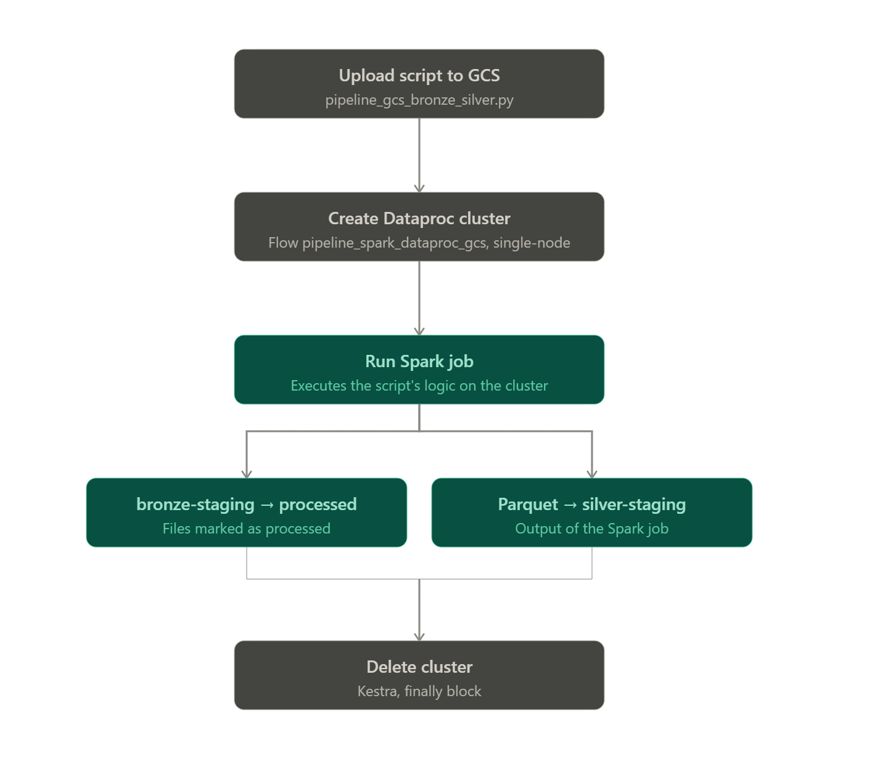

# Spark

## Structure

This describes Spark in this project.

The process is:
1. `pipeline_gcs_bronze_silver.py` is uploaded to GCS.
2. The Spark cluster is then created through the `pipeline_spark_dataproc_gcs` flow in Kestra. For the purposes of this personal project, this cluster is single-node.
3. After creating the cluster, this flow runs a Spark job to execute the logic in `pipeline_gcs_bronze_silver.py`.
4. The processed files are then moved from bronze-staging to bronze-processed. The parquet files generated by the Spark job are loaded into silver-staging.
5. Finally, the cluster is deleted.



## Troubleshooting
```Shell

gcloud compute instances list --zones=us-central1-b --project=careful-airfoil-367403 # To list all running instances
gcloud dataproc clusters list --region=us-central1 --project=careful-airfoil-367403 # To list all running clusters
gcloud dataproc batches list --region=us-central1 --project=careful-airfoil-367403 # To list the result of each job that try to run.

```