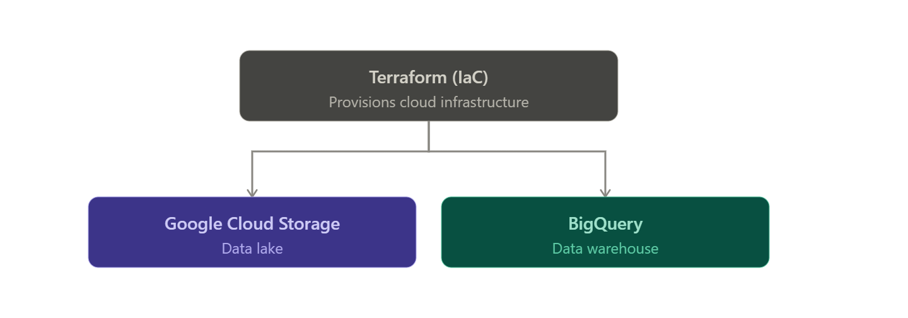

 # Terraform

Terraform is IaC (Infrastructure as Code), and it's great because you can quickly create, test, and tear down resources in a cloud platform. It also makes teamwork easier, since you can push to a repo that gives the team visibility and governance over what gets created in the cloud.

Terraform is used to create Google Cloud Storage (Datalake) and Bigquery (Warehousing). 



Execute the services that you define in main.tf

```Shell

terraform init # initialize the local enviroment with dependency and variables for the specific cloud platform.

terraform plan # Compares the cloud environment against the configuration defined in main.tf.

terraform apply # Apply the configure that are in main.tf

terraform destroy # Destroy the configure that are in terraform.tfstate

```

## Connect with GCP

Create a services Account, where need the following roles active:
- Storage Admin
- Bigquery Admin
- Compute Admin

## Pre-Requisites

- Terraform client installation: https://www.terraform.io/downloads
- Cloud Provider account: https://console.cloud.google.com/

## Project infrastructure modules in GCP:
- Google Cloud Storage (GCS): Data Lake
- BigQuery: Data Warehouse

## Initial Setup

# Refresh token/session, and verify authentication

```Shell
gcloud auth application-default login
# Setup for Access
# IAM Roles for Service account:

# Go to the IAM section of IAM & Admin https://console.cloud.google.com/iam-admin/iam
# Click the Edit principal icon for your service account.
# Add these roles in addition to Viewer : Storage Admin + Storage Object Admin + BigQuery Admin
# Enable these APIs for your project:

# https://console.cloud.google.com/apis/library/iam.googleapis.com
# https://console.cloud.google.com/apis/library/iamcredentials.googleapis.com
# Please ensure GOOGLE_APPLICATION_CREDENTIALS env-var is set.

export GOOGLE_APPLICATION_CREDENTIALS="<path/to/your/service-account-authkeys>.json"

```

